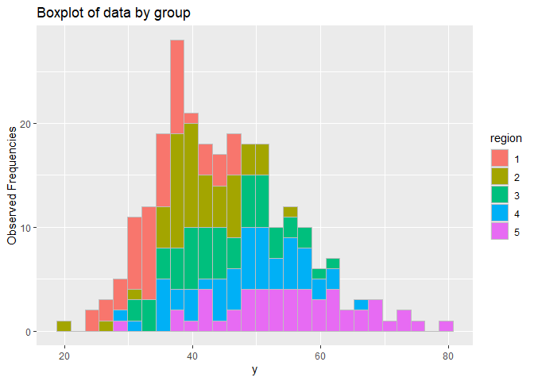
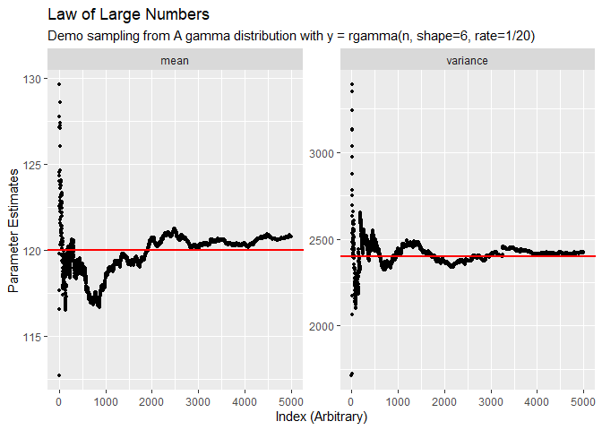
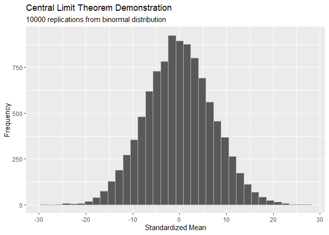
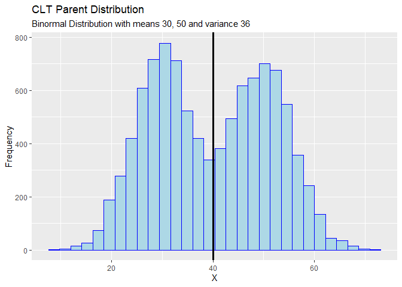

<!-- README.md is generated from README.Rmd. Please edit that file -->

# surveyr

<!-- badges: start -->

[](https://github.com/danjdrennan/surveyr/actions)
[](https://app.codecov.io/gh/danjdrennan/surveyr?branch=main)
<!-- badges: end -->

The package is intended for use in an education setting working with
survey data. It provides tools for computing statistics from surveys
using simple random sampling and stratified designs. Plotting is
simplified with a thin wrapper on ggplot2 functions, enabling a user to
easily create aesthetic graphs. Functions for deriving the sampling
distribution of a small population and probability demos are also
included in the package. The probability demos cover the law of large
numbers and the central limit theorem.

## Installation

You can install the development version of surveyr from
[GitHub](https://github.com/) with:

``` r
# install.packages("devtools")
devtools::install_github("danjdrennan/surveyr")
```

## Example: Working with a Simple Random Sample

The most basic element for studies is a simple random sample with a
known population size. With data from a simple random sample, one can
estimate the population mean, total, or proportion using `mk_stat` as
follows:

``` r
# This library is designed to work alongside tidy packages,
# especially tidyr, tibble, dplyr, and ggplot2
library(dplyr)
#> 
#> Attaching package: 'dplyr'
#> The following objects are masked from 'package:stats':
#> 
#>     filter, lag
#> The following objects are masked from 'package:base':
#> 
#>     intersect, setdiff, setequal, union
library(tibble)
library(ggplot2)
library(surveyr)
# Generate a dataset to for README examples
set.seed(1)
d <- tibble::tibble(
    region = rep(1:5, 50),
    y = rnorm(250, 30 + 5*region, 5*sqrt(region))
)
N <- rpois(5, 100)

mk_stat(d$y, N=sum(N), stat="mean", fpc=TRUE)
#> # A tibble: 1 x 5
#>       n point   var    se    cv
#>   <int> <dbl> <dbl> <dbl> <dbl>
#> 1   250  45.0  54.9  7.41 0.165
```

The output gives a summary of the estimated population statistics,
including the point estimate, variance of the estimate, standard error,
and coefficient of variation. Each column relates to the estimated
statistic, not the population. The `fpc` argument determines whether or
not to use a finite population correction. In any case, the population
size, `N`, must be supplied.

## Example: Working with a stratified dataset

If the data are grouped by some stratified variable (fixed effect), then
a similar data summary can be obtained using `make_summary`.

``` r
# Tabulate summary statistics for a stratified probability sample
make_summary(.data=d, .group=region, .y=y, .group_N=N, .fpc = TRUE, .stat="mean")
#> # A tibble: 5 x 7
#>   region     N     n point   var    se    cv
#>    <int> <dbl> <int> <dbl> <dbl> <dbl> <dbl>
#> 1      1   101    50  35.6  16.4  4.04 0.114
#> 2      2   104    50  41.1  20.4  4.52 0.110
#> 3      3    99    50  44.8  30.5  5.52 0.123
#> 4      4    97    50  48.1  37.6  6.13 0.127
#> 5      5   100    50  55.5  59.5  7.71 0.139
```

This table summary can be useful for comparing stratified groups, but it
is often an intermediate computation to estimating a total population
statistic. Using the pipe operator, we can compose functions to obtain
that stratified result as follows:

``` r
d %>% make_summary(.group=region, .y=y, .group_N=N, .fpc = TRUE, .stat="mean") %>%
    stratified_stat(.stat="mean", .fpc=TRUE)
#> # A tibble: 1 x 6
#>   Ntotal ntotal point    var    se      cv
#>    <dbl>  <int> <dbl>  <dbl> <dbl>   <dbl>
#> 1    501    250  45.0 0.0650 0.255 0.00567
```

Data plots can also be produced using `s_plot`, a thin wrapper on
`ggplot2`. The wrapper supports easy plotting of histograms and boxplots
for simple random samples or grouped data.

``` r
d %>% s_plot(y, region, kind="hist")
```



# Example: Probability Demos

Demos of the Law of Large Numbers and the Central Limit Theorem are also
provided. The Law of Large Numbers draws samples from a particular Gamma
distribution, giving no flexibility to the user. The Central Limit
Theorem demo actually provides flexibility for choosing the
distribution. In the CLT case, a user can choose between a binormal
distribution, a uniform distribution, or a gamma distribution with any
choice of parameterizations. Simply calling the functions will generate
plots using GGPlot as a backend, as can be seen next.

``` r
lln <- lln_demo()
lln$plot
```



``` r
clt <- clt_demo()
clt$plot
```



The central limit theorem demo also gives draws from the sampled
distribution for visualizing what the parent distribution looked like,
along with the theoretical parameters from the distribution, as can be
seen below.

``` r
clt$data %>% as_tibble %>% ggplot(aes(x=value)) +
    geom_histogram(bars=30, color="blue", fill="lightblue") + 
    geom_vline(xintercept = clt$popmean, size=1.2) +
    labs(
        title = "CLT Parent Distribution",
        subtitle = "Binormal Distribution with means 30, 50 and variance 36",
        x = "X",
        y = "Frequency"
    )
#> Warning: Ignoring unknown parameters: bars
#> `stat_bin()` using `bins = 30`. Pick better value with `binwidth`.
```


